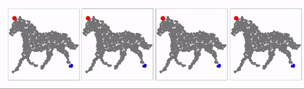
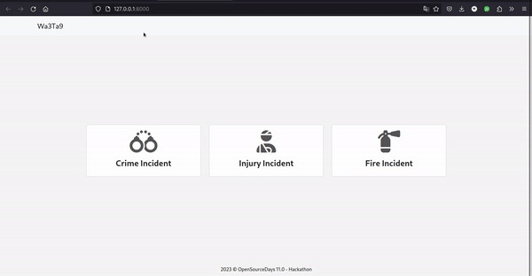
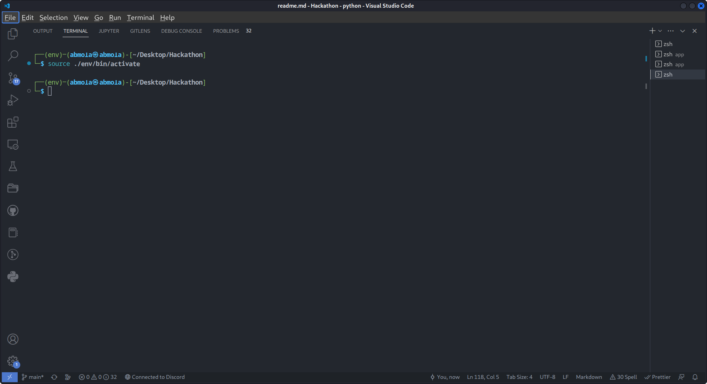
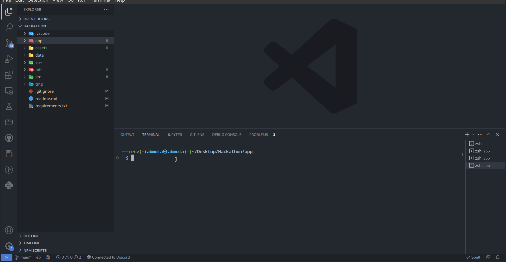

# 🏆 OpenSource 11 Hackathon Winners
This Repo contains our proposed solution for the [**OpenSource**](https://opensource.rf.gd/) HackaThon organized at __ENSA khouribga__.


## Winners
| [@Yasser Nabouzi](https://github.com/NBGamer99)  | [@Hamza Messrar](https://github.com/ez7mz) | [@Yasser Zaghloul](https://github.com/zarhyas) |
| ------------- | ------------- | ------------- |
|   |   |   |

## Table Of Contents
[TOC]


# Important 🚨

> 🦥 we are just lazy to refactor the code so fell free to do any changes and by cloning and send pulling requests.

##Theme  &nbsp;&nbsp;&nbsp;&nbsp;&nbsp;&nbsp;&nbsp;&nbsp;&nbsp;&nbsp;&nbsp;&nbsp;&nbsp;&nbsp;&nbsp;&nbsp;&nbsp;&nbsp;🚑&nbsp;&nbsp;&nbsp;&nbsp;&nbsp;&nbsp;&nbsp;&nbsp;&nbsp;&nbsp;&nbsp;&nbsp;&nbsp;&nbsp;&nbsp;&nbsp;&nbsp;&nbsp;&nbsp;&nbsp;&nbsp;🚓


The 36-hour challenge focused on addressing the critical issue of emergency vehicle distribution and routing in growing cities. As cities continue to expand, the number of vehicles on the roads is increasing, leading to a rise in accidents and emergencies. The challenge aimed to optimize response time to these incidents by developing a system that would efficiently distribute available emergency vehicles from the nearest depots to the location of the incident while selecting the optimal route. The system was designed with the primary goal of minimizing response time, taking into account factors such as distance, traffic conditions, and the number of turns in the route.

## Our Proposed Solution

To achieve our goal of minimizing response time, we developed a solution based on the [`A* algorithm`](https://en.wikipedia.org/wiki/A*_search_algorithm) and used a [`heuristic`](https://en.wikipedia.org/wiki/Heuristic_(computer_science)) function to minimize the distance and turns in the route while taking into account the capacity and level of the incident. This approach allowed us to efficiently select the optimal route from the nearest depot to the location of the incident, taking into account factors such as the available capacity of the vehicles and the severity of the incident.

<center>


*A star algorithm - [source](https://en.wikipedia.org/wiki/A*_search_algorithm)*
</center>

## Final Product



## Project Structure
### Dirs
```bash
└─ Hackathon
	├── app                  # The Web app solution is here (Django)
	├── assets				 # images and files
	├── data				 # datasets
	├── pdf					 # all pdf files (subject / Formalization)
	├── readme.md            # readme file
	├── requirements.txt     # env requirements
	└── src                  # contains
```
### App
```bash
└─ app
	├── data    			 # datasets to be loaded in databse
	├── Home				 # home app with full application logic in views
	├── manage.py			 # manager file
	├── setup-app.sh		 # a little script to setup your app
	├── templates			 # all the HTML pages
	└── wa3ta9				 # the core of the app

```

### src
>🧯 Here you can find some throwaway code used for testing purposes.
```bash
├── main.ipynb
├── maps.ipynb
├── number_of_turns.ipynb
├── shortest_path.ipynb
├── traffic.ipynb
└── vehicule.ipynb
```

## App setup

Let's start by creating a virtual environment.

### Virtual Environment Setup
#### 1. Create a Virtual Environment :

```bash
$ python3 -m venv env
```

or

```bash
$ virtualenv env
```

This will create a Python self contained virtual environment that contains a specific version of Python and any associated libraries and dependencies.This allows for the creation of isolated environments for different projects or purposes, without affecting your overall system Python installation. eliminating any possibility for conflicting files and packages.

After running the previous command a folder by the name **env** should appear.


### 2. Activate your virtual environment :

To activate your virtual environment run the following commands that corresponds to your OS.

- **Windows** :
    - **cmd :**

        ```bash
        $ env\Scripts\activate.bat
        ```

    - **powershell :**

        ```bash
        $ env\Scripts\activate.ps
        ```

- **Mac/Linux :**


    ```bash
     $ source ./env/bin/activate
    ```


This will activate our virtual environment by adding an **env** next to our terminal command line.



To deactivate it you can run the following command

```bash
$ deactivate
```

In order to not fall in any compatibilities issues it's highly recommended to update your pip and setuptools by running the following :

```bash
$ pip install pip -U
$ pip install setuptools -U
```

### 3. Installing the required libraries :

now we will install the required libraries needed for our project to run which python made easy using pip on a requirements.txt file.

```bash
$ pip install -r requirements.txt
```


## Prerequisites
### Spatialite
Spatialite-bin is a command-line tool that provides spatial database functionality to SQLite, a popular open-source relational database management system. Spatialite-bin is essentially an extension of SQLite that adds support for geospatial data types and functions, allowing you to store, manipulate, and analyze spatial data within SQLite databases.

### Install for debian
```shell

sudo apt install spatialite-bin
sudo apt-get install sqlite3 libsqlite3-dev
sudo apt-get install binutils libproj-dev gdal-bin
```

### check installation version
```shell
$ spatialite --version
```

### Output

```txt
3.40.1 2022-12-28 14:03:47 df5c253c0b3dd24916e4ec7cf77d3db5294cc9fd45ae7b9c5e82ad8197f3alt1
```

✅ And you are all set !


# Run your application


in the app folder run and follow along
```bash
sh ./setup-app.sh
```



